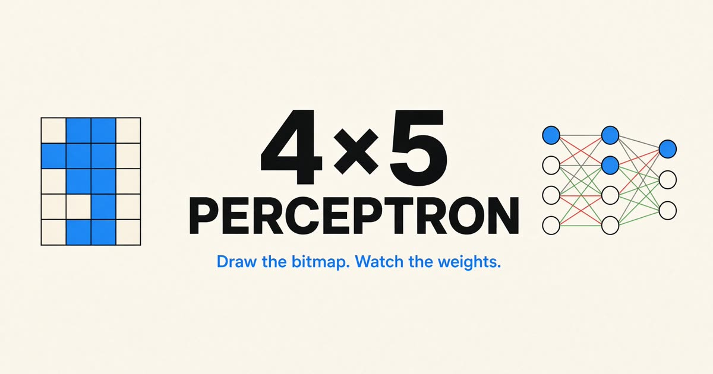

  

# Multi-Layer Perceptron (MLP) Neural Network Numeral Image Recognition Demo

Draw a digit on a 4×5 grid. A small network — 20 inputs, 8 tanh hidden units,
and an 11-way softmax — calls it 0–9 or `?`, and the diagram next to the grid
shows the weights and activations behind that call.

**Use it:** [https://mlp-demo.vercel.app/](https://mlp-demo.vercel.app/)

That URL tracks `main`. Changes land on
[`pre-production`](https://github.com/rjstone/mlp-demo/tree/pre-production)
first, and reach production through a pull request into `main`.

The training set is a handful of hand-built glyphs, close edits, and junk
patterns labeled `?`. Eight hidden units cover that neighborhood. They do not
read handwriting in general.

How the net, the colors, and the deploy work:
[AGENTS.project.md](AGENTS.project.md).

Licensed under the [MIT License](LICENSE).
